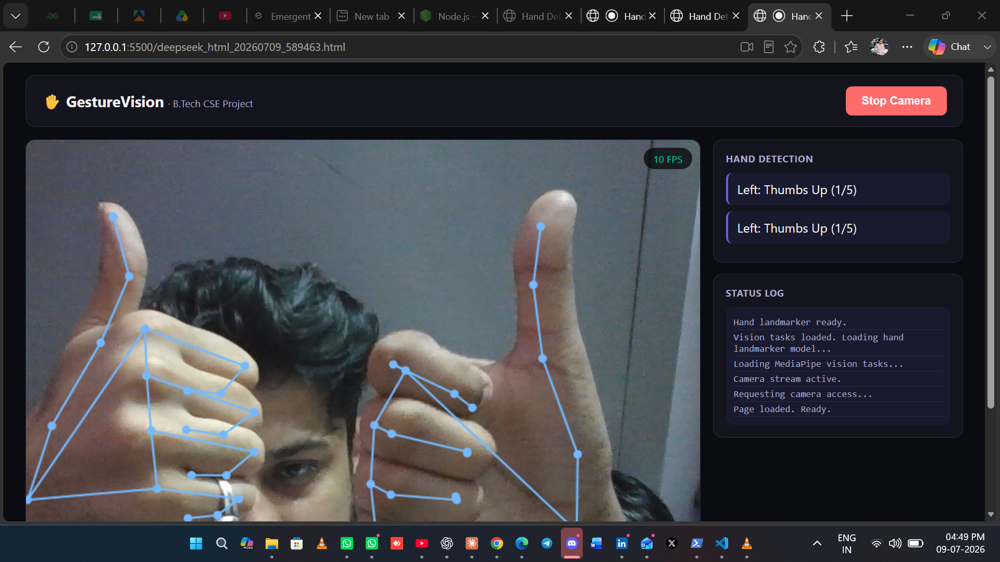
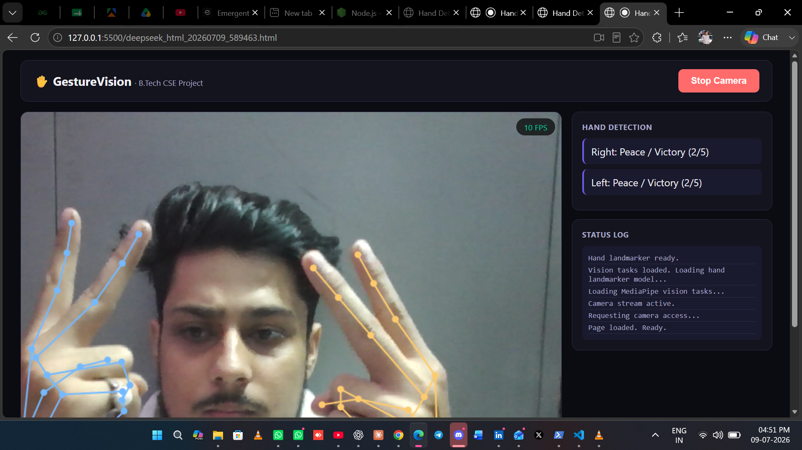

# ✋ GestureVision — Real-Time Hand Detection & Gesture Recognition

A browser-based computer vision project that detects hands in real time using your webcam, tracks 21 hand landmarks per hand, counts raised fingers, and recognizes gestures — built entirely with **JavaScript and MediaPipe Tasks Vision**, no installation required.

## 📌 Project Overview

Built as part of my B.Tech CSE coursework to explore applied computer vision and real-time ML inference directly in the browser. Uses Google's **MediaPipe Hand Landmarker** (Tasks Vision API) for detection, with custom logic layered on top for finger counting and gesture classification.

**Features:**
- Detects up to 2 hands simultaneously, in real time
- Identifies Left vs Right hand
- Counts fingers raised (0–5) per hand
- Recognizes gestures: Fist, Open Palm, Thumbs Up, Peace/Victory
- Live FPS counter
- On-screen status log for transparent debugging

## 🎥 Demo

## 🎥 Demo
   


## 🛠️ Tech Stack

- HTML, CSS, JavaScript (vanilla, no frameworks)
- MediaPipe Tasks Vision (`@mediapipe/tasks-vision`) — runs entirely client-side
- Canvas API for landmark rendering

## 🚀 Getting Started

Camera access requires a secure context (HTTPS or localhost) — opening the file directly (`file://`) will not work in most browsers.

**Option 1 — VS Code Live Server**
1. Open `hand-detection-app.html` in VS Code
2. Right-click → "Open with Live Server"

**Option 2 — Python simple server**
```bash
python -m http.server 8000
```
Then open `http://localhost:8000/hand-detection-app.html`

**Option 3 — Live deployed link**
> Add your Netlify/GitHub Pages link here once deployed

## 🔮 Future Improvements

- [ ] Sign-language alphabet recognition
- [ ] Gesture-controlled UI actions (volume, slides, etc.)
- [ ] Mobile camera support
- [ ] Custom gesture training mode

## 🎓 About

B.Tech CSE student exploring Computer Vision and Applied AI.
